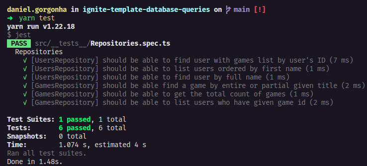

<h1 align="center">🚀 Chapter III do Ignite - Trilha NodeJS</h1>
<p align="center">
  Desafio 01: Database Queries
  <br>
  
</p>
<h1 align="center">:pushpin: Sobre o desafio</h1>
Nesse desafio, você realizará consultas no banco de dados com o TypeORM de três maneiras:

- Usando o ORM
- Usando Query Builder
- Usando Raw Query

Isso irá te ajudar a entender e exercitar os diferentes tipos de consultas que podemos fazer.

No template, você irá encontrar uma aplicação já estruturada (apenas as entidades e repositórios) onde você deverá completar o que falta nas consultas dos dois repositórios.

A aplicação possui dois módulos: `users` e `games`. Um **usuário** pode ter vários jogos e um mesmo **jogo** pode estar associado a vários usuários.

### :keyboard: Instalação e Execução do Projeto

- Clone este repositório

```
> git clone https://github.com/danielgorgonha/ignite-template-database-queries.git
```

- Navegue até o diretório principal do projeto

```
> cd ignite-template-database-queries
```

- Instale as dependências com o Yarn

```
yarn
```

- Rode a suite de testes

```
yarn test
```

- Execute o projeto

```
yarn dev
```

<p align="center">
  
</p>

## :memo: Licença

Esse projeto está sob a licença MIT. Veja o arquivo [LICENSE](https://github.com/git/git-scm.com/blob/master/MIT-LICENSE.txt) para mais detalhes.

---

Feito com 💜 by <a href="https://www.linkedin.com/in/danielgorgonha/">Daniel R Gorgonha</a> :wave: